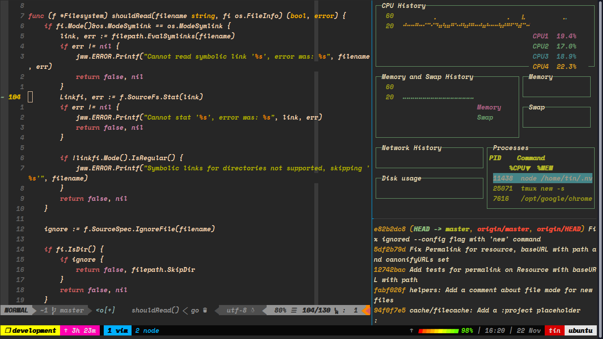

# My macOS and Linux dotfiles

> Dotfiles are awesome!

## Getting Started

There are my dotfiles that I use on my macOS and Linux machine. The main focus are about VIM and Tmux and ZSH. 

Please consider that all settings in there are just for my persional value. You can clone this repository and customize some settings before installing.

### Prerequisites

You need to have the `git`, `VIM`, `Tmux`, `curl/wget` on your machine first. Of course! 

It's not mandatory but it's better if you install all util tools on your machine. These are awesome tools and will help you become much more productivity! 

- [ack](https://beyondgrep.com/) - a tool like grep, optimized for programmers
- [rg](https://github.com/BurntSushi/ripgrep) - ripgrep - recursively searches directories for a regex pattern
- [fzf](https://github.com/junegunn/fzf) - A command-line fuzzy finder
- [ctags](http://ctags.sourceforge.net/) - A multilanguage implementation of Ctags
- [Tmuxinator](https://github.com/tmuxinator/tmuxinator)- Manage complex tmux sessions easily

### Installing

The [install.sh](install.sh) scripts will automatically backup your current dotfiles into the `~/.dotfiles-backup` directory. So you can revert if you want.

To install dotfiles, you can use the install script using cURL:

```sh
curl -o- https://raw.githubusercontent.com/NguyenTrungTin/dotfiles/master/install.sh | bash
```

Or Wget:

```sh
wget -qO- https://raw.githubusercontent.com/NguyenTrungTin/dotfiles/master/install.sh | bash
```

##### Uninstall/Revert

To uninstall/revert to your previous dotfiles, you can use the uninstall script using cURL/Wget. For Example:

```sh
curl -o- https://raw.githubusercontent.com/NguyenTrungTin/dotfiles/master/uninstall.sh | bash
```

## Contributing

Please read [CONTRIBUTING.md](CONTRIBUTING.md) for details on our code of conduct, and the process for submitting pull requests to us.

## Authors

* **Tin Nguyen** - [NguyenTrungTin](https://github.com/NguyenTrungTin)

## Credits

*This project is heavily inspired by awesome opensourcer and books:*

> Awesome dotfiles: 
- [Mathias Bynens's dotfiles](https://github.com/mathiasbynens/dotfiles)
- [alrra's dotfiles](https://github.com/mathiasbynens/dotfiles)
- [gpakosz's tmux config](https://github.com/gpakosz/.tmux)

> Awesome Books: 
- [Practical Vim: Edit Text at the Speed of Thought](https://pragprog.com/book/dnvim2/practical-vim-second-edition)
- [Tmux 2: Productive Mouse-Free Development](https://pragprog.com/book/bhtmux2/tmux-2)

## License

This project is licensed under the [MIT](LICENSE.md) License.

